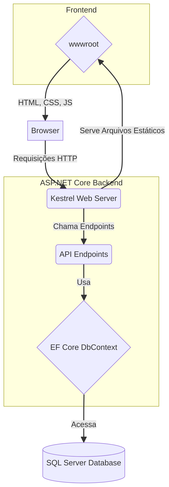

# WebAppEstudo: Aplicação Web com ASP.NET Core, Kestrel e SQL Server

Este projeto é um web app de exemplo construído com ASP.NET Core, projetado para rodar localmente. Ele demonstra uma arquitetura híbrida onde o back-end, servido pelo Kestrel, fornece tanto uma API RESTful para gerenciamento de clientes quanto as páginas web (HTML, CSS, JS) que consomem essa API. O objetivo principal é servir como um material de estudo claro e didático sobre a criação de aplicações web modernas com .NET, Entity Framework Core e um banco de dados SQL Server local.

## Arquitetura do Projeto

A aplicação segue uma estrutura simples e desacoplada, ideal para fins de aprendizado. O diagrama abaixo ilustra os principais componentes e o fluxo de comunicação entre eles:



1.  **Browser**: O cliente acessa a aplicação através de um navegador web.
2.  **Kestrel Web Server**: O servidor web embutido do ASP.NET Core recebe as requisições HTTP.
3.  **Arquivos Estáticos (`wwwroot`)**: Kestrel serve os arquivos de front-end (HTML, CSS, JavaScript) diretamente para o browser.
4.  **API Endpoints**: As interações de dados (CRUD de clientes) são feitas através de requisições do JavaScript para os endpoints da API (`/api/clientes`).
5.  **Entity Framework Core (`DbContext`)**: A camada de acesso a dados que traduz as chamadas da API em queries para o banco de dados.
6.  **SQL Server**: O banco de dados local onde as informações dos clientes são armazenadas.

## Tecnologias Utilizadas

- **Back-end**: .NET 9, ASP.NET Core, Entity Framework Core 9
- **Banco de Dados**: SQL Server Express LocalDB
- **Front-end**: HTML5, CSS3, JavaScript (ES6+), Bootstrap 5
- **Servidor Web**: Kestrel

## Pré-requisitos

Para compilar e executar este projeto, você precisará ter os seguintes softwares instalados:

- **.NET SDK 9.0** ou superior.
- **SQL Server Express** (ou qualquer outra edição do SQL Server).
- **SQL Server Management Studio (SSMS)** ou outra ferramenta de gerenciamento de banco de dados (como Azure Data Studio).

## Como Configurar e Executar o Projeto

Siga os passos abaixo para colocar a aplicação em funcionamento.

### 1. Crie o Banco de Dados e a Tabela

Abra o SSMS ou Azure Data Studio e execute o script SQL localizado em `Docs/Database-schemas/Scripts/01_CreateDatabase_And_InitialData.sql`. Este script irá:

- Criar o banco de dados `WebAppEstudo`
- Criar a tabela `clientes` com a estrutura completa
- Criar índices para otimização de consultas
- Inserir 10 registros de exemplo para testes

**Estrutura da tabela `clientes`:**

```sql
CREATE TABLE [dbo].[clientes] (
    [id] INT IDENTITY(1,1) NOT NULL PRIMARY KEY,
    
    -- Dados do cliente
    [nome] NVARCHAR(200) NOT NULL,
    [endereco] NVARCHAR(200) NULL,
    [idade] INT NULL CHECK ([idade] >= 0 AND [idade] <= 150),
    [telefone] NVARCHAR(30) NULL,
    
    -- Campos de controle e auditoria (gerenciados automaticamente pelo sistema)
    [dataCadastro] DATETIME2(0) NOT NULL DEFAULT GETDATE(),
    [dataUltimoRegistro] DATETIME2(0) NOT NULL DEFAULT GETDATE(),
    
    -- Soft delete: permite exclusão lógica sem perder dados
    [deletado] BIT NOT NULL DEFAULT 0
);
```

**Campos de controle do sistema:**

- **`dataCadastro`**: Registrado automaticamente pelo sistema quando um cliente é criado. Não é editável.
- **`dataUltimoRegistro`**: Atualizado automaticamente pelo sistema sempre que um cliente é criado, editado ou deletado.
- **`deletado`**: Campo booleano que indica se o cliente foi excluído logicamente (soft delete). Passa de `false` para `true` quando o cliente é excluído.

Estes campos **não são exibidos** no formulário de edição, mas **`dataCadastro` e `dataUltimoRegistro` são mostrados** no modal de visualização de detalhes.

### 2. Configure a Connection String

Para manter a sua connection string segura e fora do controle de versão, usaremos o **User Secrets** do .NET. Abra um terminal na pasta raiz do projeto (`/webappEstudo`) e execute os comandos abaixo.

Primeiro, inicialize o User Secrets para o projeto:

```bash
dotnet user-secrets init
```

Em seguida, adicione a sua connection string. **Substitua `SEU-SERVIDOR` pelo nome da sua instância do SQL Server** (por exemplo, `.\SQLEXPRESS` ou `(localdb)\mssqllocaldb`).

```bash
dotnet user-secrets set "ConnectionStrings:DefaultConnection" "Server=SEU-SERVIDOR;Database=WebAppEstudo;Trusted_Connection=True;TrustServerCertificate=True;"
```

### 3. Execute a Aplicação

Com o banco de dados e a connection string configurados, execute o projeto com o seguinte comando:

```bash
dotnet run
```

A aplicação estará disponível em `http://localhost:<porta>`, onde `<porta>` é a porta informada no console (geralmente algo entre 5000 e 5300).

- **Menu Principal**: `http://localhost:<porta>`
- **Página de Clientes**: `http://localhost:<porta>/pages/clientes.html`
- **API de Clientes**: `http://localhost:<porta>/api/clientes`

## Estrutura do Projeto

```
/webappEstudo
├── Contracts/         # Data Transfer Objects (DTOs) para a API
│   └── Clientes/      # DTOs específicos para o recurso Cliente
├── Data/              # Classes de entidade e o DbContext do EF Core
├── Docs/              # Documentação e diagramas
│   └── Database-schemas/
│       └── Scripts/   # Scripts SQL para criação do banco
├── Endpoints/         # Definição dos endpoints da API (Minimal APIs)
├── Properties/        # Configurações de inicialização do projeto (launchSettings.json)
├── Wwwroot/           # Raiz dos arquivos estáticos (front-end)
│   ├── Css/
│   ├── Js/
│   └── Pages/
├── appsettings.json   # Configurações da aplicação
├── Program.cs         # Ponto de entrada da aplicação
└── webappEstudo.csproj  # Arquivo de projeto .NET
```

## Detalhes da Implementação

### Back-end

O back-end é construído usando as **Minimal APIs** do ASP.NET Core, o que torna o código mais conciso e direto.

- **`Program.cs`**: Arquivo principal que configura e inicializa a aplicação. Ele registra os serviços (como o `AppDbContext`), configura o pipeline de requisições HTTP (servir arquivos estáticos, roteamento) e mapeia os endpoints.

- **`Data/AppDbContext.cs`**: Classe do Entity Framework Core que representa a sessão com o banco de dados. Ela contém o `DbSet<Cliente>` que permite realizar operações de CRUD na tabela `clientes`. Implementa filtros globais para soft delete, garantindo que registros deletados não apareçam nas consultas normais.

- **`Data/Cliente.cs`**: Classe de entidade que mapeia para a tabela `clientes` no banco de dados. Os atributos (como `[Table]`, `[Key]`, `[MaxLength]`) são usados para configurar o mapeamento objeto-relacional. Inclui os campos de controle `DataCadastro`, `DataUltimoRegistro` e `Deletado`.

- **`Endpoints/ClientesEndpoints.cs`**: Define todos os endpoints da API para o recurso `Cliente` (`GET`, `POST`, `PUT`, `DELETE`). O uso de `MapGroup` ajuda a organizar as rotas de forma coesa. Implementa soft delete no endpoint DELETE, marcando o registro como deletado ao invés de removê-lo fisicamente.

- **`Contracts/Clientes/`**: Contém os DTOs (Data Transfer Objects) que definem a estrutura de dados trafegada entre o cliente e a API:
  - `ClienteListDto`: Campos exibidos na listagem (ID, Nome, Telefone)
  - `ClienteCreateDto`: Campos fornecidos ao criar um cliente (Nome, Endereço, Idade, Telefone)
  - `ClienteUpdateDto`: Campos editáveis de um cliente (Nome, Endereço, Idade, Telefone)

### Front-end

O front-end é intencionalmente simples, utilizando HTML e JavaScript puro (com o auxílio do Bootstrap para o layout) para focar nos fundamentos.

- **`Wwwroot/Pages/clientes.html`**: Estrutura HTML da página de gerenciamento de clientes. Contém a tabela, os botões de ação, os filtros e os modais para visualização, edição e criação. O modal de visualização exibe os campos `dataCadastro` e `dataUltimoRegistro`, enquanto o modal de edição não os inclui.

- **`Wwwroot/Js/crudList.js`**: Um motor de front-end genérico e reutilizável criado para este projeto. Ele gerencia a lógica de paginação, filtragem, seleção de itens em uma tabela e o acionamento dos botões de ação. Ele foi projetado para ser configurado e estendido por outras partes do sistema.

- **`Wwwroot/Js/clientes.js`**: Script específico para a página de clientes. Ele cria uma instância do `CrudList`, fornecendo as configurações necessárias para interagir com a API de clientes (`/api/clientes`) e manipular os modais de CRUD. Formata as datas de cadastro e último registro para exibição no padrão brasileiro.

## Funcionalidades Implementadas

### Soft Delete

O sistema implementa **soft delete**, o que significa que os registros não são fisicamente removidos do banco de dados quando excluídos. Em vez disso, o campo `deletado` é marcado como `true`. Isso oferece várias vantagens:

- **Recuperação de dados**: Registros excluídos acidentalmente podem ser recuperados
- **Auditoria**: Mantém histórico completo de todos os registros
- **Integridade referencial**: Evita problemas com chaves estrangeiras em sistemas maiores

O filtro global configurado no `AppDbContext` garante que apenas registros não deletados sejam retornados nas consultas normais.

### Auditoria Automática

O sistema registra automaticamente:

- **Data de cadastro**: Quando o cliente é criado pela primeira vez
- **Data do último registro**: Atualizada sempre que o cliente é criado, editado ou deletado

Estes campos são gerenciados exclusivamente pelo back-end, garantindo consistência e evitando manipulação indevida.

## Próximos Passos e Melhorias

Este projeto é um ponto de partida. Algumas melhorias que podem ser implementadas para expandir o aprendizado incluem:

- **Validação Avançada**: Implementar validação mais robusta no back-end (usando bibliotecas como FluentValidation) e no front-end.
- **Autenticação e Autorização**: Adicionar um sistema de login para proteger os endpoints.
- **Logging e Monitoramento**: Integrar um sistema de logging estruturado (como Serilog) e adicionar Health Checks.
- **Testes Automatizados**: Criar testes de unidade para a lógica de negócio e testes de integração para os endpoints da API.
- **Componentização do Front-end**: Migrar o front-end para uma biblioteca baseada em componentes, como React, Vue ou Blazor, para melhor organização e reutilização.
- **Recuperação de Registros Deletados**: Implementar uma interface administrativa para visualizar e restaurar registros deletados.
